# pemrograman-visual-3B-2024

Repository untuk praktikum Pemrograman Visual 3B 2024

**Modul 1** aplikasi daftar beasiswa
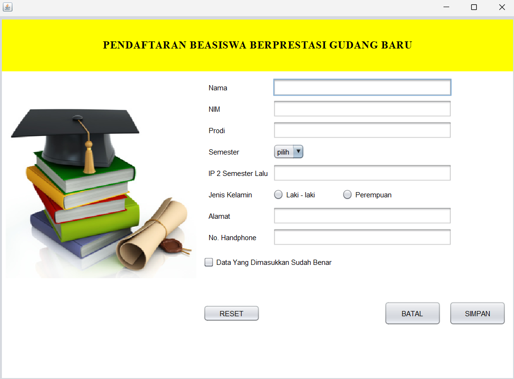
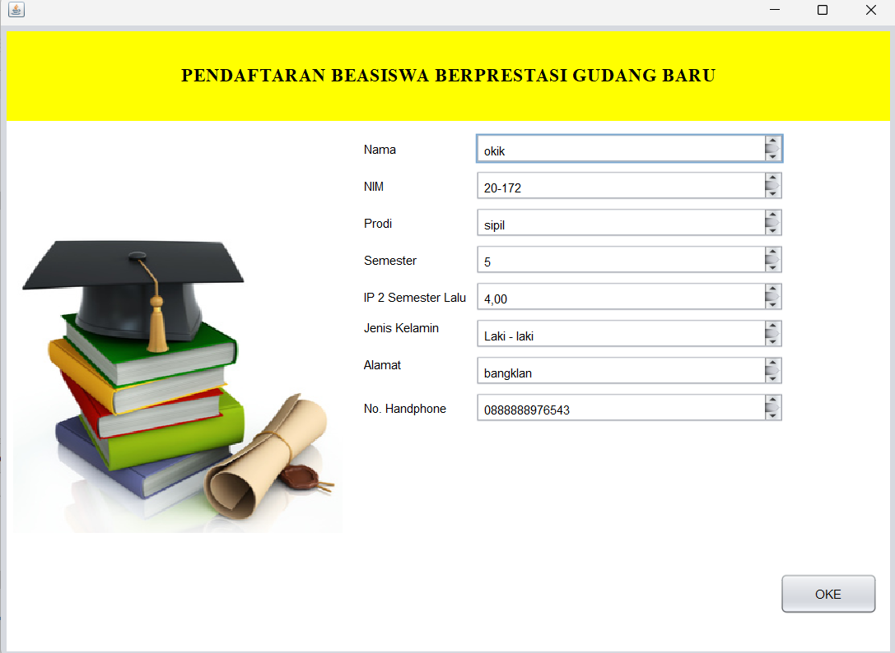

**Modul 2** aplikasi toko roti
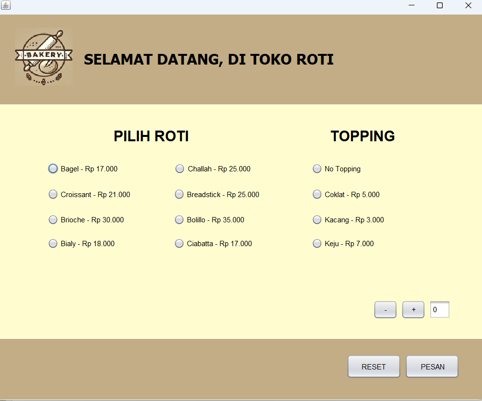
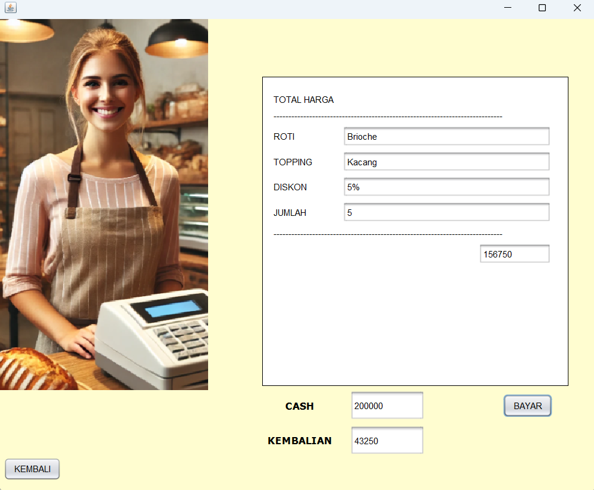

**Modul 3** aplikasi apotek dan pembayaran
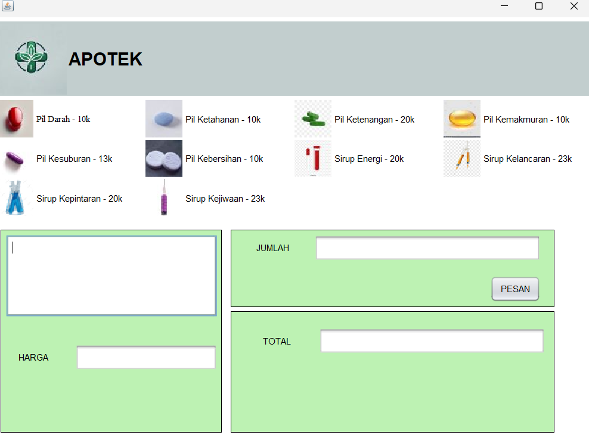
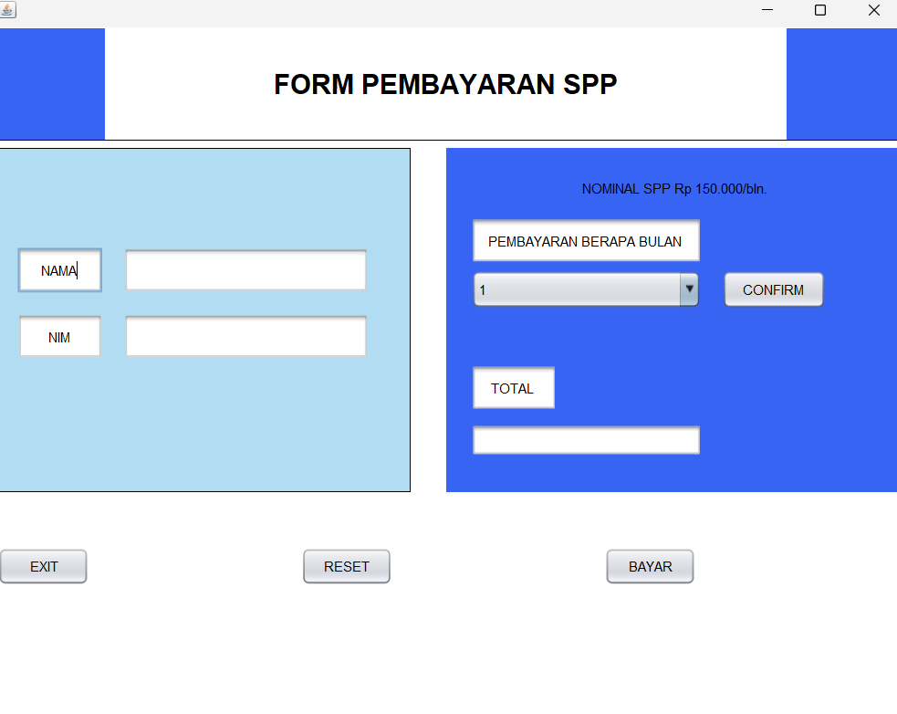
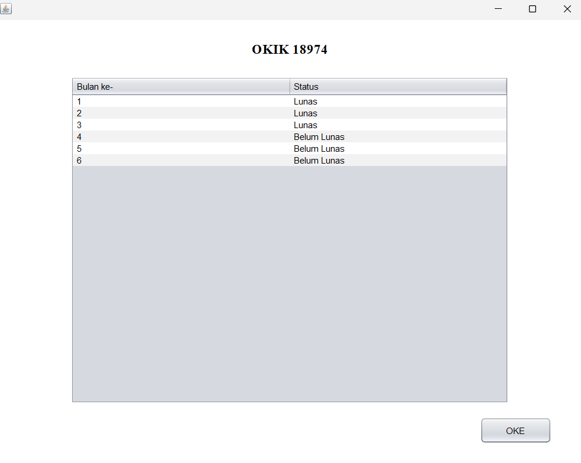

**Modul 4** aplikasi game tebak angka
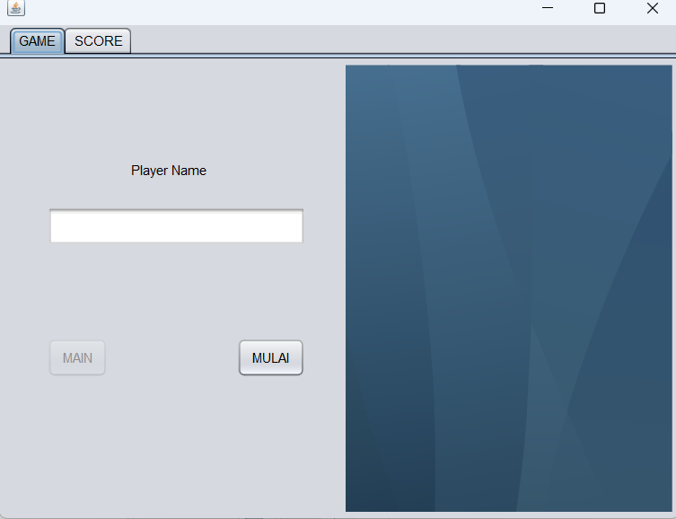
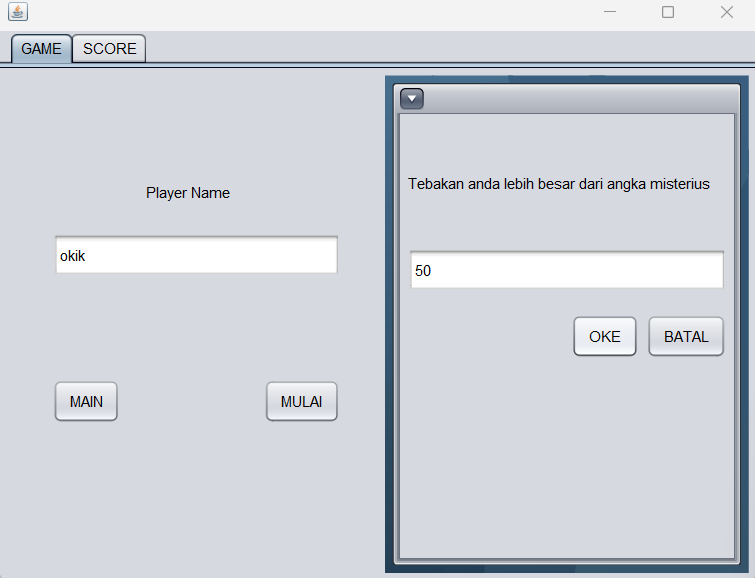
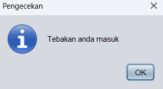
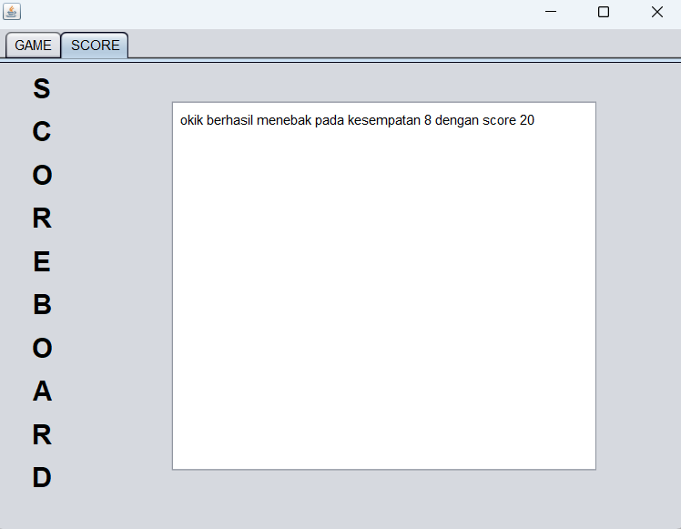

**Modul 5** aplikasi CRUD 
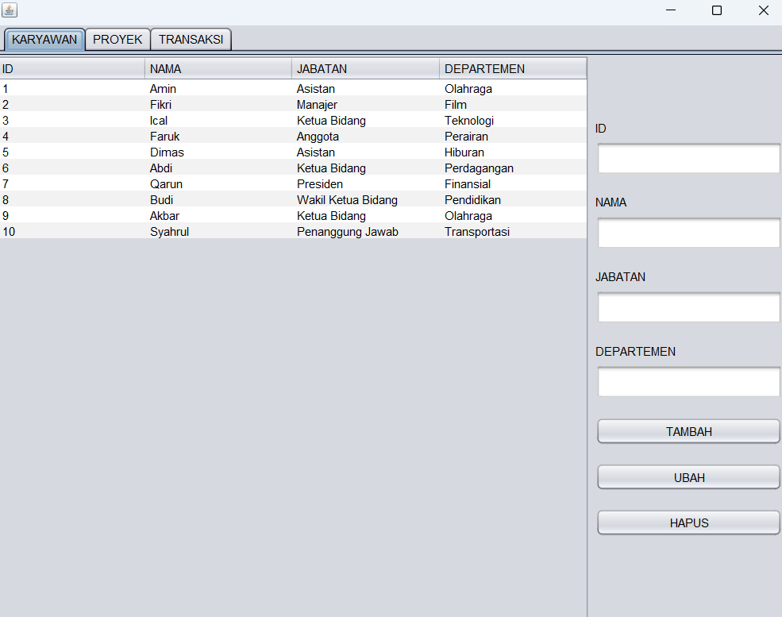
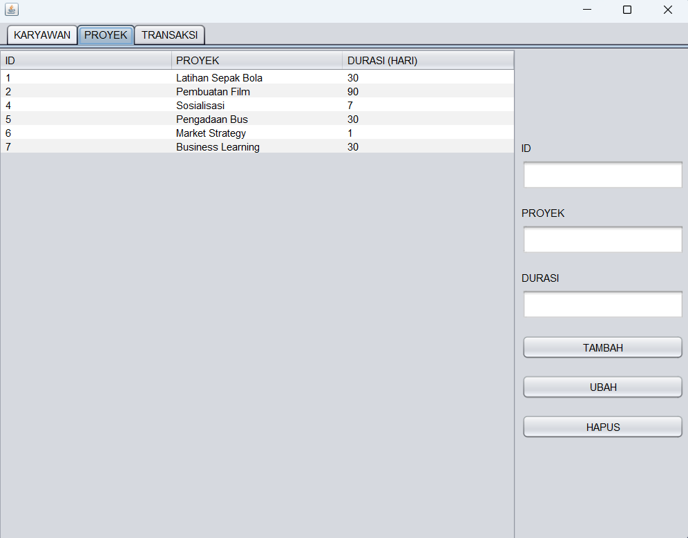
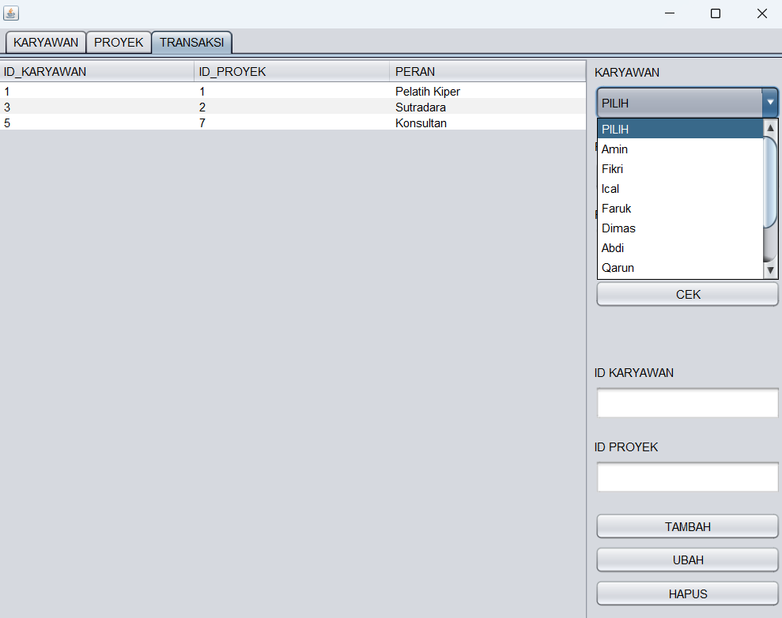
